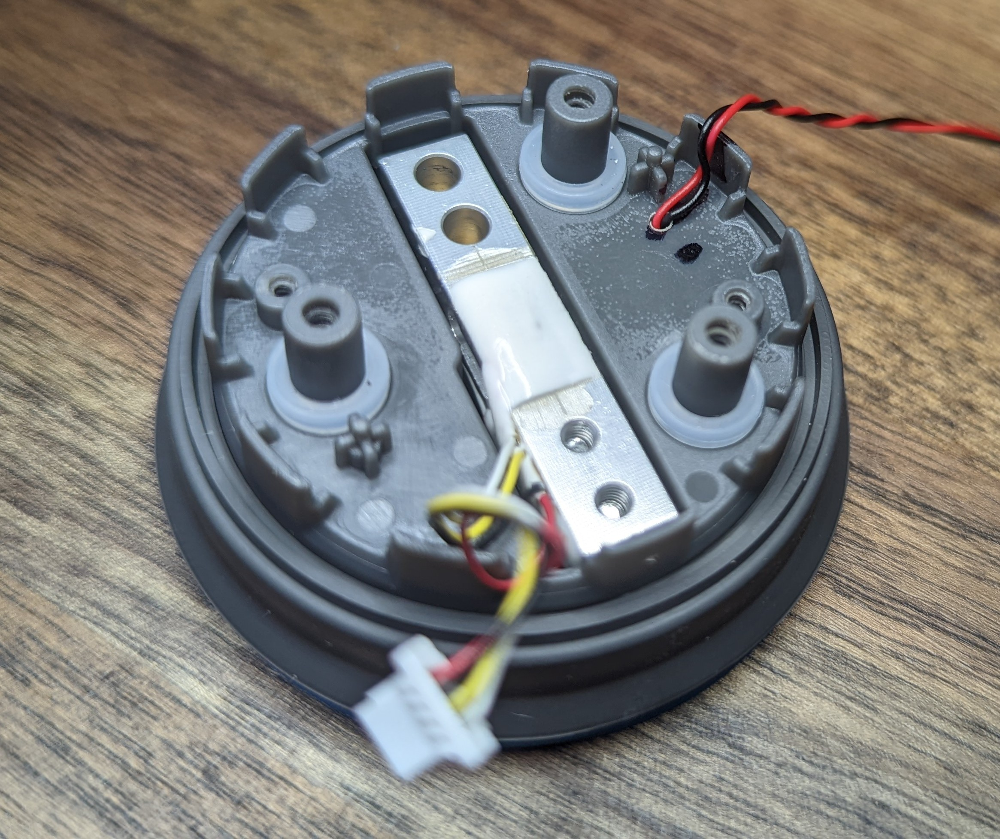

# HidrateSpark PRO Qi charging retrofit

- [HidrateSpark PRO Qi charging retrofit](#hidratespark-pro-qi-charging-retrofit)
  - [Prep](#prep)
    - [BOM](#bom)
      - [micro qi charge coil](#micro-qi-charge-coil)
      - [AWG 30 or similar wire](#awg-30-or-similar-wire)
      - [4x m2x4mm screws](#4x-m2x4mm-screws)
    - [Tools](#tools)
      - [Note on adhesives](#note-on-adhesives)
    - [Parts](#parts)
  - [Assemble](#assemble)
    - [puck disassembly and cleaning](#puck-disassembly-and-cleaning)
    - [WCRA assembly](#wcra-assembly)
  - [Finish](#finish)

This document is concerned with the products in the HidrateSpark family that have a 3 inch / 7.6 cm diameter.
There is a '32oz Stainless Steel' version of the bottle which does appear to have a larger diameter (3.8 inch / 9.6 cm) which likely means a different shape of sensor puck so the guide below likely won't work without some modifications.

I have only tested this with the 620ml / 21oz version of the hidrate spark bottle as that's the bottle I have.
If you have a different size bottle and mange to pull off this modification, please open a discussion to share!
If you had to make any modifications or have an idea on how to improve the process, please open a PR!

<!-- Needs to be done via GH web UI for embed to work.  -->

// TODO: still or photo of the assembled device with no wires but green LEDs

## Prep

Several of the steps below involve adhesives with limited setup/cure time.
Take the time to prepare your work piece and have the necessary tools ready.

Read the full document before starting to get an idea of the process.

### BOM

- [ ] [micro qi charge coil](https://www.aliexpress.com/item/3256802090851265.html)
- [ ] AWG 30 or similar wire
- [ ] 4x m2x4mm screws

#### micro qi charge coil

Depending on which site you search, you can find many many different Qi compatible wireless chargers.
It took me a while to find a supplier for incredibly small.

Specifically the `Yellow` version with the 14mm² PCB, not the 10.5mm² pcb.
The smaller PCB was not in stock when I was beginning to source parts but it should work with this design.
The entire design likely could have been simplified if the smaller PCB version was in stock as the 14mm² version is _almost_ small enough to fit **inside** the sensor puck.

#### AWG 30 or similar wire

The sensor puck does not need a lot of current and free space through which to route cables is at a minimum so the smaller the wire the better.

You will need at least 8 inches but longer lengths will make some assembly and test steps _much_ easier.

#### 4x m2x4mm screws

The ones I used came from a "universal" kit. The CAD files assume a screw with these dimensions

//TODO - get dimensions from cad

However, this McMaster part ([91292A004](https://www.mcmaster.com/91292A004/)) is virtually identical so it should work.

### Tools

- [ ] A driver for the m2 screws
  - Required.
- [ ] Super glue
  - **Optional** but highly recommended. See [note](#note-on-adhesives) below.
- [ ] Hot glue
  - Required.
- [ ] 2mm drill bit
  - Required. The diameter does not have to be super precise so long as you can make a hole through which two strands of wire can pass through
- [ ] soldering iron + solder
  - Required. Required to clean up some solder joints on the wireless charge receiver and sensor puck PCB
- [ ] clamp
  - Required. A vice or similar would also work; anything that can securely hold the 3d printed parts to the bottom of the sensor puck for a few hours while the glue sets up will work.

https://user-images.githubusercontent.com/1808375/172755046-aff784c8-6ea4-4007-bc96-c282fa8b5f3c.mp4

- [ ] bubble level
  - Optional. Use this to check for even/level alignment at a few points in assembly.
- [ ] basic multimeter
  - optional but highly recommended for testing.

#### Note on adhesives

You might be able to get away with just hot glue but I have had poor results with silicone rubber material like the material coating the outside of the sensor puck. Hotglue is _fine_ for everywhere else in this build but I don't think it's the right adhesive to secure the components to the water bottle.

### Parts

There are two parts:

- The 'bottom': this is most of the mass / contains the Qi coil
- The 'anchor': this is the smaller of the two parts.

Tolerances are tight and the shapes/dimensions need to be as precise as possible so print as slow as you need to in order to achieve this.

Support material is optional but I opted for it; negligible additional time/material cost for some certainty.

I had good results with my 'stock' prusa mk3s with .4mm nozzle using .15mm layer heights.

Print with at least 3 perimeters as we need the additional mass for some mechanical strength around where the screw threads will go.

Ironing for the top surface for the 'bottom' is a very good idea. This resulted in a NOTICEABLE improvement in surface finish for a dimensionally critical area. This is optional for the 'anchor' part; I didn't bother.

//TODO: get suggested print orientation / layout + settings screenshot

## Assemble

This will happen in a few 'phases':

- puck disassembly and cleaning
- wireless charge receiver assembly (`WCRA`)
- mechanically connecting the `WCRA` to the puck
- electrically connecting the `WCRA` to the puck

I have included photos for _most_ steps but not all. If something isn't clear, open a discussion thread to ask about it.

### puck disassembly and cleaning

**Note:** The puck is composed of three components:

- The 'bottom': this is where you grip/twist the puck to remove it from the bottle. This is also one of the anchor points for the load cell.
- The 'top': this is the everything after the silicon rubber section between the 'bottom' and the clear plastic where you can see the LEDs from. This includes the rest of the grey plastic above the light ring.
- The 'midframe': this is internal. It supports the PCB and is the second anchor point for the load cell. The 'top' screws into this component.

1. Remove the sensor puck from the bottle. Use a philips screw driver to remove the three screws from the top of the puck. Set these screws aside so you do not lose them!
2. _Gently_ separate the 'top' of the puck from the 'bottom' Be mindful of the battery; there is a short cable plugged into the PCB on the 'midframe'. Unplug the battery and set the 'top` aside.
3. Unplug the load cell from the PCB
4. Unscrew the two small screws holding the PCB to the 'midframe' and set aside.
5. Lift the PCB away from the midframe and set aside.
6. Unscrew the two philips screws on the load cell. These screws hold the load cell to the 'bottom'. Set aside.
7. Pull the 'midframe' up. Do this carefully as the silicone rubber from the 'bottom' is molded around the midframe. Set aside.
8. Thoroughly clean the bottom of the puck. The cleaner this part of the puck is, the better chance that the glue will hold. I suggest the top rack / silverware drawer in the dishwasher for a cycle.

### WCRA assembly

- [ ] Use the m2 screws to push out the support material and form threads in the plastic.

- [ ] Use a small blade or tweezers or similar to remove the additional flashing material.

    Removed material:
    

- [ ] Drive the m2 screws through the 'anchor'. This will deform the plastic slightly. That's OK so long as the deformation is minor.

- [ ] next step

- [ ] next step

- [ ] next step

- [ ] next step

- [ ] next step

- [ ] next step

- [ ] next step

- [ ] next step

- [ ] next step

- [ ] next step

- [ ] next step

## Finish

You will absolutely need to re-calibrate your water bottle after doing this modification.

