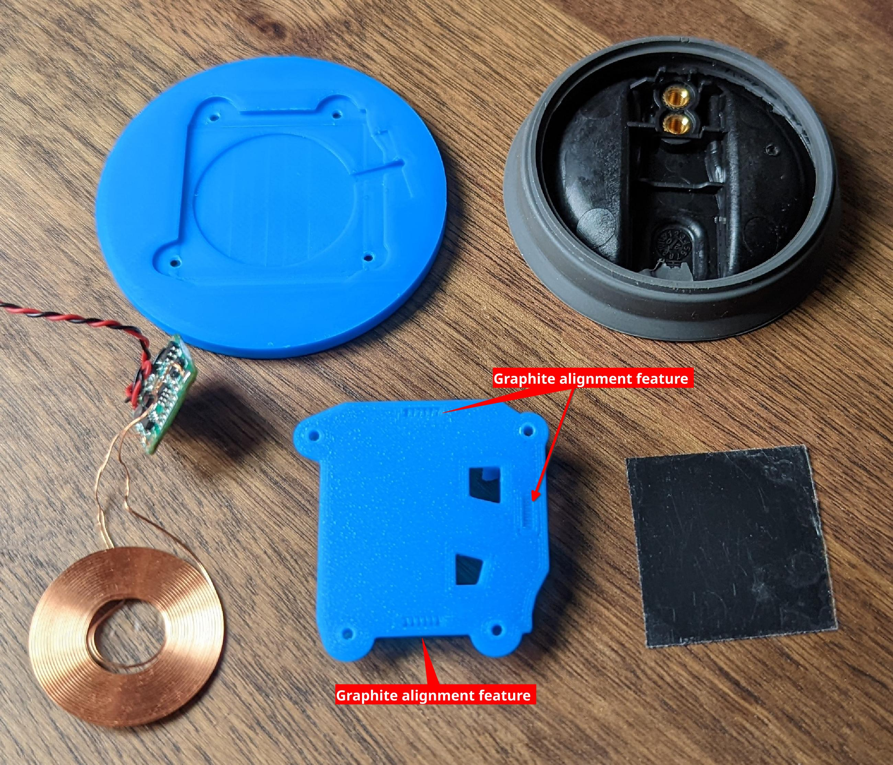

# HidrateSpark PRO Qi charging retrofit

- [HidrateSpark PRO Qi charging retrofit](#hidratespark-pro-qi-charging-retrofit)
  - [Prep](#prep)
    - [BOM](#bom)
      - [micro qi charge coil](#micro-qi-charge-coil)
      - [AWG 30 or similar wire](#awg-30-or-similar-wire)
      - [4x m2x4mm screws](#4x-m2x4mm-screws)
    - [Tools](#tools)
      - [Note on adhesives](#note-on-adhesives)
    - [Parts](#parts)
  - [Assemble](#assemble)
    - [puck disassembly and cleaning](#puck-disassembly-and-cleaning)
    - [wireless receiver prep](#wireless-receiver-prep)
    - [WCRA assembly](#wcra-assembly)
  - [Finish](#finish)

This document is concerned with the products in the HidrateSpark family that have a 3 inch / 7.6 cm diameter.
There is a '32oz Stainless Steel' version of the bottle which does appear to have a larger diameter (3.8 inch / 9.6 cm) which likely means a different shape of sensor puck so the guide below likely won't work without some modifications.

I have only tested this with the 620ml / 21oz version of the hidrate spark bottle as that's the bottle I have.
If you have a different size bottle and mange to pull off this modification, please open a discussion to share!
If you had to make any modifications or have an idea on how to improve the process, please open a PR!

// TODO: still or photo of the assembled device with no wires but green LEDs

<!-- markdownlint-disable-file MD034 -->
https://user-images.githubusercontent.com/1808375/172755046-aff784c8-6ea4-4007-bc96-c282fa8b5f3c.mp4

## Prep

<!-- still in beta, but GH is playing with admonish style call-out: https://github.com/orgs/github-community/discussions/16925#discussion-4085374 -->

> **Warning**
> Several of the steps below involve adhesives with limited setup/cure time. Take the time to prepare your work piece and have the necessary tools ready.

<!-- markdownlint-disable-next-line MD028 -->
> **Note**
> Read the full document before starting to get an idea of the process.

### BOM

- [ ] [micro qi charge coil](https://www.aliexpress.com/item/3256802090851265.html)
- [ ] AWG 30 or similar wire
- [ ] 4x m2x4mm screws

#### micro qi charge coil

Depending on which site you search, you can find many many different Qi compatible wireless chargers.
It took me a while to find a supplier for incredibly small.

Specifically the `Yellow` version with the 14mm² PCB, not the 10.5mm² pcb.
The smaller PCB was not in stock when I was beginning to source parts but it should work with this design.
The entire design likely could have been simplified if the smaller PCB version was in stock as the 14mm² version is _almost_ small enough to fit **inside** the sensor puck.

#### AWG 30 or similar wire

The sensor puck does not need a lot of current and free space through which to route cables is at a minimum so the smaller the wire the better.

You will need at least 8 inches but longer lengths will make some assembly and test steps _much_ easier.

#### 4x m2x4mm screws

The ones I used came from a "universal" kit. The CAD files assume a screw with these dimensions

| measurement  | dimenstion (mm) |
| ------------ | --------------- |
| head width   | XX              |
| head height  | xx              |
| shaft width  | xx              |
| total length | xx              |

//TODO - get dimensions from cad

However, McMaster part ([91292A004](https://www.mcmaster.com/91292A004/)) is virtually identical so it should work.

### Tools

- [ ] A driver for the m2 screws
  - Required.
- [ ] Super glue
  - **Optional** but highly recommended. See [note](#note-on-adhesives) below.
- [ ] Hot glue
  - Required.
- [ ] 2mm drill bit
  - Required. The diameter does not have to be super precise so long as you can make a hole through which two strands of [wire](#awg-30-or-similar-wire) can pass through
- [ ] soldering iron + solder
  - Required. Required to clean up some solder joints on the wireless charge receiver and sensor puck PCB
- [ ] clamp
  - Required. A vice or similar would also work; anything that can securely hold the 3d printed parts to the bottom of the sensor puck for a few hours while the glue sets up will work.
- [ ] bubble level
  - Optional. Use this to check for even/level alignment at a few points in assembly.
- [ ] basic multimeter
  - optional but highly recommended for testing.

#### Note on adhesives

> **Note**
> You might be able to get away with just hot glue but I have had poor results with silicone rubber material like the material coating the outside of the sensor puck. Hotglue is _fine_ for everywhere else in this build but I don't think it's the right adhesive to secure the components to the water bottle.

### Parts

There are two parts:

- The ['bottom' (`bottom-lid.step`)](cad/bottom-lid.step): this is most of the mass / contains the Qi coil
- The ['anchor' (`anchor-bracket.step`)](cad/anchor-bracket.step): this is the smaller of the two parts.

> **Warning**
> Tolerances are _tight_ and the shapes/dimensions need to be as precise as possible so print as slow as you need to in order to achieve this.

In the suggested print orientation, the amount of support material is negligible. I opted for support material for the 4 screw recesses on the 'bottom' component. The additional time/material cost was insignificant and it resulted in a much 'cleaner' hole which is preferable as this design does not permit any error here; the screw recesses need to be 100% clear of material or the screws will not sit flush!

I had good results with my 'stock' prusa mk3s with .4mm nozzle using .15mm layer heights.

Print with **at least 3 perimeters** as we need the additional mass for some mechanical strength around where the screw threads will go.

[Ironing](https://help.prusa3d.com/article/ironing_177488) for the top surface for the 'bottom' is a very good idea. This resulted in a NOTICEABLE improvement in surface finish for a dimensionally critical area. This is optional for the 'anchor' part; I didn't bother.

Material choice shouldn't really matter here; most 'common' 3d printer filaments should work well with most adhesives.
I went with PLA because that's what was in the printer from the last print.

## Assemble

This will happen in a few 'phases':

- puck disassembly and cleaning
- wireless charge receiver assembly (`WCRA`)
- mechanically connecting the `WCRA` to the puck
- electrically connecting the `WCRA` to the puck

I have included photos for _most_ steps but not all. If something isn't clear, open a discussion thread to ask about it.

### puck disassembly and cleaning

The sensor puck is composed of three components:

- The 'bottom': this is where you grip/twist the puck to remove it from the bottle. This is also one of the anchor points for the load cell.
- The 'top': this is the everything after the silicon rubber section between the 'bottom' and the clear plastic where you can see the LEDs from. This includes the rest of the grey plastic above the light ring.
- The 'midframe': this is internal. It supports the PCB and is the second anchor point for the load cell. The 'top' screws into this component.

> **Note**
> The goal here is to break the sensor puck down into it's components. Drill a small hole through some of the components so wires can pass from the bottom exterior of the puck into the puck body. Then thoroughly clean the sensor puck bottom for ideal adhesive strength.

1. Remove the sensor puck from the bottle. Use a philips screw driver to remove the three screws from the top of the puck. Set these screws aside so you do not lose them!
2. _Gently_ separate the 'top' of the puck from the 'bottom' Be mindful of the battery; there is a short cable plugged into the PCB on the 'midframe'. Unplug the battery and set the 'top` aside.
3. Unplug the load cell from the PCB
4. Unscrew the two small screws holding the PCB to the 'midframe' and set aside.
5. Lift the PCB away from the midframe and set aside.
6. Unscrew the two philips screws on the load cell. These screws hold the load cell to the 'bottom'. Set aside.
7. Pull the 'midframe' up. Do this carefully as the silicone rubber from the 'bottom' is molded around the midframe. Set aside.
8. Thoroughly clean the bottom of the puck. The cleaner this part of the puck is, the better chance that the glue will hold. I suggest the top rack / silverware drawer in the dishwasher for a cycle.

//TODO: re-work the instructions to account for the drill step. Needs guidance on locating WHERE to drill. Drill from the midframe through to the bottom of the sensor puck.

### wireless receiver prep

> **Note**
> The goal here is to make sure that the receiver works and that the wires go 'into' the PCB from the side with the components on it ('top'). Any wire or solder blobs protruding from the rear of the PCB should be **as small as possible** and absolutely should not extend beyond the PCB by more than ~1mm!

- [ ] test your coil before modifying it to ensure that it works!
- [ ] de-solder the existing DC leads from the PCB if attached. Use a solder sucker or similar to remove all extra solder from the hole on the PCB
- [ ] de-solder the AC/Coil leads from the PCB as well. Use a solder sucker or similar to remove all extra solder from the hole on the PCB.
- [ ] re-attach the AC/Coil wires to the PCB using the minimum possible amount of solder. You want to insert the wires in from the side of the PCB with all the components on it.Ideally, there would NOT be a big solder blob or similar on the back of the PCB.
- [ ] Do the same with your AWG 30 wire.

//TODO: closeup photo of the PCB after i've cleaned it up and applied minimal possible solder.

### WCRA assembly

> **Note**
> The goal here is to secure the PCB to the 'anchor' and then align the Qi receiver coil and graphite pad in the 'bottom' portion before securing the two with screws. After testing that the receiver coil still works, glue the entire assembly to the bottom of the sensor puck.

- [ ] Use the m2 screws to push out the support material and form threads in the plastic.

- [ ] Use a small blade or tweezers or similar to remove the additional flashing material.

    Removed material:
    

- [ ] Drive the m2 screws through the 'anchor'. This will deform the plastic slightly. That's OK so long as the deformation is minor.

- [ ] Perform a test fit. Make sure that the 'anchor' component fits into the bottom of the sensor puck. It might wiggle 'up and down' by a few mm but should be flush with the bottom of the sensor puck and should not be able to rotate or move 'side to side'.

- [ ] Prep the Qi receiver assembly, the graphite backing pad and the 3d printed parts

- [ ] Use a **small** dot of hot glue to secure the PCB to the 'anchor' component. Let the hot glue gun get fully up to temperature for best results. The plastic will immediately start to 'drain' heat from the glue which will cause it to harden. We do not want the glue to harden until after the PCB has been aligned and can be **firmly** pressed down onto the 'anchor'.

- [ ] Thread the DC wires through the bottom of the sensor puck and align the 'anchor' component with the bottom of the sensor puck.
    > **Note**
    > Notice how the PCB is flush with the 'anchor' component

    

- [ ] remove the protective plastic film from the graphite backing pad and then affix to the bottom of the 'anchor' component. Use the three small rectangle features to help you align the pad
  - [ ] TODO: get a photo of this; edit it to explicitly call out the 3 alignment features

- [ ] **Carefully** insert the Qi coil into the bottom component. Make sure the wires leave through the small channel. If you're careful, you probably won't need any hotglue to hold the coil in. If you do use hotglue make sure it is spread as thinly as possible; there is _no_ room in this design for the coil to not be flat! Combine the two parts and screw together.

- [ ] Test that the assembled WCRA works. You should get ~5v DC out of the wires when placed on a Qi charging coil.
    
    And just to be through, flip the WCRA over and confirm that you do NOT get a voltage out!
    

- [ ] It's GLUE time! Assuming you're using permanent glue, this is the point of no return! Ensure that the mating surfaces on the bottom of the puck AND the WCRA are as clean as possible. Coat the surfaces of the WCRA and then the puck with super glue and then quickly press the two together. Align the WCRA with the puck as needed; it might shift by a few mm along one axis. Once you're happy with how aligned the two are, clamp together and allow at least a few hours for the glue to set up.

- [ ] next step

- [ ] next step

- [ ] next step

## Finish

You will absolutely need to re-calibrate your water bottle after doing this modification.
