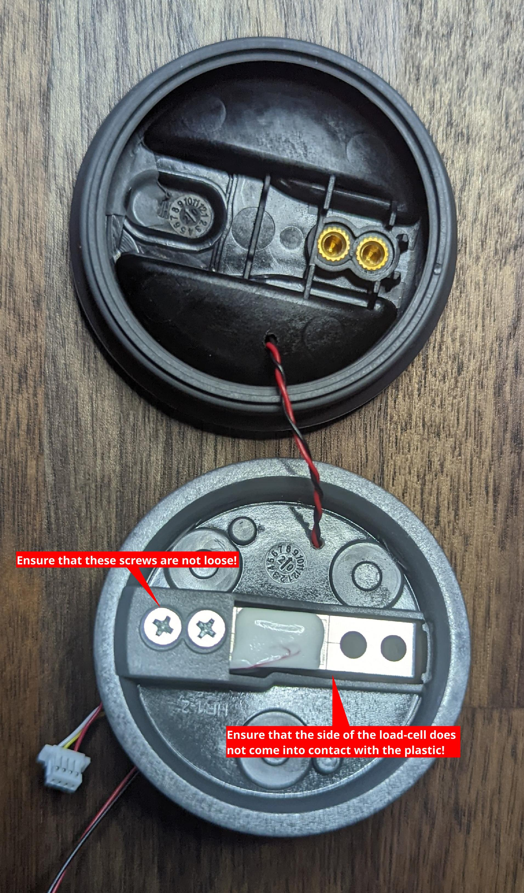

# HidrateSpark PRO Qi charging retrofit

Below you'll find (somewhat) comprehensive instructions and associated CAD files for modifying a HidrateSpark water bottle to charge with commodity Qi wireless coils instead of the proprietary and failure-prone USB cable.

Background as to the how/why of this modification can be found in the [accompanying post](https://karlquinsland.com/hidrate-spark-qi-retrofit) on my personal site.

<!-- Github does have support for embedded media files but you have to upload via the web UI. After that's done, URL manually added. -->
<!-- markdownlint-disable-file MD034 -->
https://user-images.githubusercontent.com/1808375/172755046-aff784c8-6ea4-4007-bc96-c282fa8b5f3c.mp4

> **Warning**
> 🚨 ⚠️
> This process will make _permanent_ changes to your bottle and will absolutely void your warranty. Proceed at your own risk. Read the full document to get an idea of the extent of necessary modifications and then decide if you want to continue.

- [HidrateSpark PRO Qi charging retrofit](#hidratespark-pro-qi-charging-retrofit)
  - [Prep](#prep)
    - [BOM](#bom)
      - [micro qi charge coil](#micro-qi-charge-coil)
      - [AWG 30 or similar wire](#awg-30-or-similar-wire)
      - [4x m2x4mm screws](#4x-m2x4mm-screws)
    - [Tools](#tools)
      - [Note on adhesives](#note-on-adhesives)
    - [Parts](#parts)
  - [Assemble](#assemble)
    - [sensor puck](#sensor-puck)
      - [puck components](#puck-components)
      - [puck disassembly, drilling and cleaning](#puck-disassembly-drilling-and-cleaning)
      - [drill location](#drill-location)
    - [wireless receiver prep](#wireless-receiver-prep)
    - [WCRA assembly](#wcra-assembly)
  - [Finish](#finish)
  - [License](#license)

This document is concerned with the products in the HidrateSpark family that have a 3 inch / 7.6 cm diameter.
There is a '32oz Stainless Steel' version of the bottle which does appear to have a larger diameter (3.8 inch / 9.6 cm) which likely means a different sensor puck so the guide below likely won't work without some modifications.

I have only tested this with the 620ml / 21oz version of the hidrate spark bottle as that's the bottle I have.
If you have a different size bottle and mange to pull off this modification, please open a [discussion](https://github.com/kquinsland/hidrate-spark-qi-charging/discussions) to share!
If you had to make any modifications or have an idea on how to improve the process, please open a PR!

## Prep

<!-- still in beta, but GH is playing with admonish style call-out: https://github.com/orgs/github-community/discussions/16925#discussion-4085374 -->

> **Warning**
> Several of the steps below involve adhesives with limited setup/cure time. Take the time to prepare your work piece and have the necessary tools ready.

### BOM

- [ ] [micro qi charge coil](#micro-qi-charge-coil)
- [ ] [AWG 30 or similar wire](#awg-30-or-similar-wire)
- [ ] [4x m2x4mm screws](#4x-m2x4mm-screws)
- [ ] [3d printed parts](#parts)

#### micro qi charge coil

I sourced the coil used in this project from this Ali Express listing: [VEEAII DIY Qi Standard Wireless Charging Coil Receiver Module Circuit Board DIY Wireless Charging Coil for iPhone Samsung](https://www.aliexpress.com/item/3256802090851265.html)

Specifically the `Yellow` version with the 14mm² PCB, not the 10.5mm² pcb.
The smaller PCB was not in stock when I was beginning to source parts but it should work with this design.
The entire design likely could have been simplified if the smaller PCB version was in stock as the 14mm² version is _almost_ small enough to fit **inside** the sensor puck.

#### AWG 30 or similar wire

The sensor puck does not need a lot of current and free space through which to route cables is at a minimum so the smaller the wire the better.

You will need at least 8 inches but longer lengths will make some assembly and test steps _much_ easier.

#### 4x m2x4mm screws

The ones I used came from a "universal" kit. The CAD files assume a screw with these dimensions:

| measurement  | dimension (mm) |
| ------------ | -------------- |
| head radius  | 1.8 mm         |
| head height  | 1.95 mm        |
| shaft radius | 1.5 `*`        |
| total length | 5.7 mm         |

`*` - This is intentionally undersized so the screw threads have something to bite into.

However, McMaster part ([91292A004](https://www.mcmaster.com/91292A004/)) is virtually identical so it should work.

### Tools

- [ ] A driver for the m2 screws
  - Required.
- [ ] Super glue
  - **Optional** but [highly recommended](#note-on-adhesives).
- [ ] Hot glue
  - Required.
- [ ] ~2mm drill bit
  - Required. The diameter does not have to be super precise so long as you can make a hole through which two strands of [wire](#awg-30-or-similar-wire) can pass through. I think I used a ¹⁄₁₆ drill bit.
- [ ] soldering iron + solder
  - Required. Required to clean up some solder joints on the Qi wireless charge receiver and sensor puck PCB.
- [ ] clamp
  - Required. A vice or similar would also work; anything that can securely hold the 3d printed parts to the bottom of the sensor puck for a few hours while the glue sets up will work.
- [ ] bubble level
  - Optional. Use this to check for even/level alignment at a few points in assembly.
- [ ] basic multimeter
  - Optional but highly recommended for testing.

#### Note on adhesives

You might be able to get away with just hot glue but I have had poor results when using hotglue with silicone rubber material - like the material coating the outside of the sensor puck.
Hotglue is _fine_ for everywhere else in this build but I don't think it's the right adhesive to secure the components to the water bottle.
I use superglue for attaching the modification to the bottom of the sensor puck.

### Parts

There are two parts:

- The ['bottom' (`bottom-lid.step`)](cad/bottom-lid.step): this is most of the mass / contains the Qi coil
- The ['anchor' (`anchor-bracket.step`)](cad/anchor-bracket.step): this is the smaller of the two parts.

> **Warning**
> Tolerances are _tight_ and the shapes/dimensions need to be as precise as possible so print as slow as you need to in order to achieve this.
> Parts were designed with a `.15mm` tolerance in mind. Print parts out on a printer that can meet or exceed this.

In the suggested print orientation, the amount of support material is negligible. I opted for support material for the 4 screw recesses on the 'bottom' component. The additional time/material cost was insignificant and it resulted in a much 'cleaner' hole which is preferable as this design does not permit any error here; the screw recesses need to be 100% clear of material or the screws will not sit flush!

I had good results with my 'stock' prusa mk3s with .4mm nozzle using .15mm layer heights.

Print with **at least 3 perimeters** as we need the additional mass for some mechanical strength around where the screw threads will go.

[Ironing](https://help.prusa3d.com/article/ironing_177488) for the top surface for the 'bottom' is a very good idea. This resulted in a NOTICEABLE improvement in surface finish for a dimensionally critical area. This is optional for the 'anchor' part; I didn't bother.

Material choice shouldn't really matter here; most 'common' 3d printer filaments should work well with most adhesives.
I went with PLA because that's what was in the printer from the last print.

## Assemble

This will happen in a few 'phases':

- puck disassembly, drilling and cleaning
- wireless receiver prep
- wireless charge receiver assembly (`WCRA`)
- mechanically connecting the `WCRA` to the puck
- electrically connecting the `WCRA` to the puck

> **Note**
> I have included photos for _most_ steps but not all; sometimes my hands were full or a camera was not handy. Where possible, I've tried my best to 're-shoot' photos. Apologies in advance for any photos that are missing or look like they may be from an earlier prototype design. If something isn't clear, open a discussion thread to ask about it!

### sensor puck

#### puck components

The sensor puck is composed of three components:

- The 'bottom': this is where you grip/twist the puck to remove it from the bottle. This is also one of the anchor points for the load cell.
- The 'top': this is the everything after the silicon rubber section between the 'bottom' and the clear plastic where you can see the LEDs from. This includes the rest of the grey plastic above the light ring.
- The 'midframe': this is internal. It supports the PCB and is the second anchor point for the load cell. The 'top' screws into this component.

#### puck disassembly, drilling and cleaning

> **Note**
> The goal here is to break the sensor puck down into it's components then drill a small hole through some of the components so wires can pass from the bottom exterior of the puck into the puck body. Last, thoroughly clean the sensor puck bottom for ideal adhesive strength.

1. Remove the sensor puck from the bottle. Use a philips screw driver to remove the three screws from the top of the puck. Set these screws aside so you do not lose them!
2. _Gently_ separate the 'top' of the puck from the 'bottom'. Be mindful of the battery; there is a short cable plugged into the PCB on the 'midframe'. Unplug the battery and set the 'top` aside.
3. Unplug the load cell from the PCB.
4. Unscrew the two small screws holding the PCB to the 'midframe' and set aside.
5. Lift the PCB away from the midframe and set aside.
6. Prepare the ~2mm drill bit. With the midframe attached to the bottom of the puck drill straight down through the midframe and the bottom of the pick at the [indicated location](#drill-location).
7. Unscrew the two philips screws on the load cell. These screws hold the load cell to the 'bottom'. Set aside.
8. Pull the 'midframe' up. Do this carefully as the silicone rubber from the 'bottom' is molded around the midframe. Set aside.
9. Thoroughly clean the bottom of the puck. The cleaner this part of the puck is, the better chance that the glue will hold. I suggest the top rack / silverware drawer in the dishwasher for a cycle.

#### drill location

> **Note**
> This photo shows the midframe separate from the bottom of the puck. Keep them together when you drill the hole! Use the photograph for guidance - the hole should be drilled close to the `+` shaped feature as shown; if you're off my a few mm, everything should still work.

From the bottom, it should look something like this:

### wireless receiver prep

> **Note**
> The goal here is to make sure that the receiver works and that the wires go 'into' the PCB from the side with the components on it ('top'). Any wire or solder blobs protruding from the rear of the PCB should be **as small as possible** and absolutely should not extend beyond the PCB by more than ~1mm!

- [ ] Test your coil before modifying it to ensure that it works!
- [ ] De-solder the existing DC leads from the PCB if attached. Use a solder sucker or similar to remove all extra solder from the hole on the PCB. See example photo below for what a properly cleaned hole looks like.
- [ ] De-solder the AC/Coil leads from the PCB as well. Use a solder sucker or similar to remove all extra solder from the hole on the PCB.
- [ ] Re-attach the AC/Coil wires to the PCB using the minimum possible amount of solder. You want to insert the wires in from the side of the PCB with all the components on it.Ideally, there would NOT be a big solder blob or similar on the back of the PCB.
- [ ] Do the same with your AWG 30 wire.

Here are some _example_ photos from a Qi PCB that is in process of being prepared. You'll want to get as close as possible to the demonstrated effect but for all 4 wire attachment locations, not just the two pictured here.

A properly cleaned wire hole should look like this:

You're looking for as little solder and wire from the rear of the PCB:

### WCRA assembly

> **Note**
> The goal here is to secure the PCB to the 'anchor' and then align the Qi receiver coil and graphite pad in the 'bottom' portion before securing the two with screws. After testing that the receiver coil still works, glue the entire assembly to the bottom of the sensor puck.

- [ ] Use the m2 screws to push out the support material and form threads in the plastic.

- [ ] Use a small blade or tweezers or similar to remove the additional flashing material.

    Removed material:
    

- [ ] Drive the m2 screws through the 'anchor'. This will deform the plastic slightly. That's OK so long as the deformation is minor.

- [ ] Perform a test fit. Make sure that the 'anchor' component fits into the bottom of the sensor puck. It might wiggle 'up and down' by a few mm but should be flush with the bottom of the sensor puck and should not be able to rotate or move 'side to side'. You may find a bubble level handy here to ensure that things are appropriately flush/level.

- [ ] Prep the Qi receiver assembly, the graphite backing pad and the 3d printed parts. In a moment, you will need to attach the graphite backing pad to the bottom of the 'anchor' component. Use the marked features to help you with alignment.

- [ ] Use a **small** dot of hot glue to secure the PCB to the 'anchor' component. Let the hot glue gun get fully up to temperature for best results. The plastic will immediately start to 'drain' heat from the glue which will cause it to harden. We do not want the glue to harden until after the PCB has been aligned and can be **firmly** pressed down onto the 'anchor'.

- [ ] Thread the DC wires through the bottom of the sensor puck and align the 'anchor' component with the bottom of the sensor puck.
    > **Note**
    > Notice how the PCB is flush with the 'anchor' component. Use isopropyl alcohol to undo the hotglue if you need to re-attempt this.

    

- [ ] Remove the protective plastic film from the graphite backing pad and then affix to the bottom of the 'anchor' component. Use the three small rectangle shaped features to help you align the pad. The edge of the graphite pad should just barely touch the three interior facing edges of the alignment features. **Warning:** If the graphite pad is more than a little mis-aligned, the 'bottom' component may not screw into the 'anchor' component entirely. This _will_ make the rest of process much harder to pull off.

- [ ] **Carefully** insert the Qi coil into the bottom component. Make sure the wires leave through the small channel. If you're careful, you probably won't need any hotglue to hold the coil in. If you do use hotglue make sure it is spread as thinly as possible; there is _no_ room in this design for the coil to not be flat! Combine the two parts and screw together.

- [ ] Test that the assembled WCRA works. You should get ~5v DC out of the wires when placed on a Qi charging coil.
    
    And just to be through, flip the WCRA over and confirm that you do NOT get a voltage out!
    

- [ ] It's GLUE time! Assuming you're using permanent glue, this is the point of no return! Double check that the top of the assembled WCRA is level. Ensure that the mating surfaces on the bottom of the puck AND the WCRA are as clean as possible. Coat the surfaces of the WCRA and then the puck with super glue and then quickly press the two together. Align the WCRA with the puck as needed; it might shift by a few mm along one axis. Once you're happy with how aligned the two are, clamp together and allow at least a few hours for the glue to set up.

- [ ] After the glue has setup, route the wire from the exterior of the base sensor puck and through the hole in the mid-frame.

- [ ] Use tweezers or similar to shape and route the wire as shown. The sensor puck rests on the three silicon washers around the plastic pegs so the wire must remain flat until it reaches the edge of the midframe where it can be directed up.

- [ ] During puck disassembly, you should have removed two screws that held the load-cell to the bottom of the puck. Re attach load-cell to the bottom of the puck with these screws. Make sure that the two screws holding the load-cell to the bottom of the puck are well torqued down. Failure to do this may result in a bottle that does not 'stand up' straight and/or a sensor puck that gives inaccurate measurements

- [ ] Carefully fold the silicone overmolding from the bottom puck over the lip on the midframe and then re-attach the PCB. Trim off any excess wire and then solder one wire to each of the two contact pads next to the push button as shown:

    > **Note**
    > It does not matter which wire goes to which contact pad as the PCB has the necessary diodes to sort this out.
    <!-- markdownlint-disable-next-line MD028 -->
    > **Warning**
    > Use no more solder than is necessary. The [pogo pins](https://en.wikipedia.org/wiki/Pogo_pin) in the 'top' of the sensor puck are assuming a flat surface and excessive solder on these pads could result in the pins being forced out of alignment which might cause them to short out!

- [ ] Do one final test: place the sensor puck with the WCRA on a Qi charge pad and either measure the voltage at the two soldered points and/or verify that the green LEDs come on. Assuming that ~5V is present and the green LEDs come on, re-attach the 'top' of the sensor puck. Congrats on making it this far!

## Finish

- [ ] Use a bubble level to check the top of the sensor puck. You can adjust how level the puck top is by rotating the three screws by fractions of a turn. You can also adjust the screws holding various components of the sensor puck to the load-cell if needed.

- [ ] You will absolutely need to re-calibrate your water bottle after doing this modification.

- [ ] Share your modification results! If you happen to pull this off, [please let me](https://github.com/kquinsland/hidrate-spark-qi-charging/discussions) know how well it's working out!

> **Warning**
> If all was done correctly, the two small pins on the top of the puck can _also_ still be used for charging. 🚨🚨 **DO NOT USE USB CHARGING AND WIRELESS CHARGING AT THE SAME TIME!** 🚨🚨

## License

Unless otherwise explicitly mentioned, everything in this repo is licensed under [CC NCSA 4.0 license terms](https://creativecommons.org/licenses/by-nc-sa/4.0/) as explained in the [LICENSE.md](LICENSE.md) file. In short:

- Modifications need to be attributed back to me / this repo. Your modifications must also be distributed under the CC NCSA 4.0 license terms.
- No commercial use permitted.
